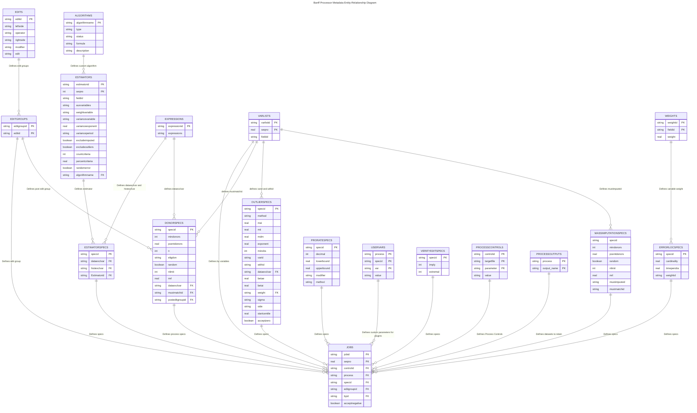

# Metadata Files

Overall, the Banff Processor uses 18 metadata tables, which can be classified as follows:

Tables describing the overall process flow:

* JOBS (required): Defines the overall process flow, including the process steps to execute and sequencing
* PROCESSCONTROLS: Optional [Process Controls](./processor-user-guide.md#process-controls) give more control over individual process steps

Tables defining process step parameters for built-in Banff procedures:

* VERIFYEDITSPECS: Specifications for the `verifyedits` procedure
* OUTLIERSPECS: Specifications for the `outlier` procedure
* ERRORLOCSPECS: Specifications for the `errorloc` procedure
* DONORSPECS: Specifications for the `donorimp` procedure
* ESTIMATORSPECS: Specifications for the `estimator` procedure
  * ESTIMATORS: Additional parameters for `inestimator` table
  * ALGORITHMS: Additional parameters for `inalgorithm` table
* PRORATESPECS: Specifications for the `prorate` procedure
* MASSIMPUTATIONSPECS: Specifications for the `massimp` procedure

Tables used to define edits, used by the `verifyedits`,`editstats`,`errorloc`,`deterministic`,`donorimp`, and `prorate` procedures:

* EDITS: List of individual edits
* EDITGROUPS: Combinations of edits referenced by individual process steps

Parameters used by multiple procedures:

* VARLISTS: Lists of variables and ordering
* WEIGHTS: Weights, used by some procedures
* EXPRESSIONS: Exclusion expressions used by some procedures

Process step parameters for [User Defined Procedures](./processor-user-guide.md#user-defined-procedures):

* USERVARS: Specifications for user-defined procedures (plugins)

Data management:

* PROCESSOUTPUTS: Specify which outputs should be saved from each procedure

## General notes

* ID metadata fields such as jobid or controlid can be a maximum of 100 characters
* Variable names on your input datasets can be to up 64 characters long.
* Case sensitivity: Consistency must be maintained across metadata with respect to casing. This includes matching fields such as specID and controlID as well as variable names.
* Variable names need to respect the casing of the column names on the applicable input. In certain contexts 'income' and 'INCOME' may be considered different variables on a table but in others they are not. For example, the expressions metadata is case insensitive. For this reason it is recommended to not re-use column names simply with different casing and to respect casing across data and metadata files.

## Jobs

Define your statistical data editing process flows.

|Column|Type|Primary Key|Foreign Key|Required|Description|
|--|--|--|--|--|--|
|jobid|string|&#x2714;||&#x2714;|The value of the jobid column is used to extract from the table all the rows that belong to the same E&I strategy or Process Block.|
|seqno|float| &#x2714; ||&#x2714;|The order of execution is defined by the seqno column which is read from the lowest value to the largest.  The Banff processor will run even if there are gaps in the seqno values.  For example, a value of SEQNO=10 can be followed in the next row with a value of 20.|
|controlid|string|  | &#x2714; ||Points to an ID defined in the ProcessControls metadata table.|
|process|string|  | &#x2714; |&#x2714;|The value of the process column identifies the name of the Banff procedure or plug-in to be executed.|
|specid|string|| &#x2714; |&#x2714;|The specid column points to an ID in another metadata tables depending on the value of the PROCESS column.|
|editgroupid|string||&#x2714;||The editgroupid column points to an entry in the EditGroups metadata table|
|byid|string||&#x2714;||The byid column points to the VarLists metadata table.  It can be used by all procedures except VerifyEdits and the Job process. The variable list indicated will be used for by-group processing|
|acceptnegative|string| | ||The acceptnegative column is used to indicate whether negative values are considered valid values or not by the process.  If not specified (left blank) or if the value is N, the accept negative option will not be specified, otherwise (if the value of the column is Y), the accept negative option will be set to True.|

## Process Controls

Define specifications for Process Controls.

|Column|Type|Primary Key|Foreign Key|Required|Description|
|--|--|--|--|--|--|
|controlid|string|&#x2714;||&#x2714;|ID used to identify the control.|
|targetfile|string|&#x2714;||&#x2714;|The name of the dataset file to apply the control to. This field is NOT required if parameter=EDIT_GROUP_FILTER.|
|parameter|string|&#x2714;||&#x2714;|The type of process control to apply.|
|value|string|||&#x2714;|The query (in SQL-lite syntax) to apply for this control. This field is not required and must be empty if parameter=EDIT_GROUP_FILTER.|

## Edits

Define linear consistency edits to be used by the Banff procedures.

|Column|Type|Primary Key|Foreign Key|Required|Description|
|--|--|--|--|--|--|
|editid|string|&#x2714;||&#x2714;|ID used to identify the edit.|
|leftside|string|||&#x2714;|The left-hand side of the equation.|
|operator|string|||&#x2714;|The operator, valid values include >, >=, <, <=, =, and !=.|
|rightside|string|||&#x2714;|The right-hand side of the equation.|
|modifier|string||||The modifier value. The default value of PASS indicates that the equation must be True, FAIL can be specified to indicate that the equation must be false.<BR><BR>ACCEPTE and REJET are also valid values and can be used instead of PASS and FAIL respectively.|

## Edit groups

Define sets of edits to be referenced by individual process steps.

|Column|Type|Primary Key|Foreign Key|Required|Description|
|--|--|--|--|--|--|
|editgroupid|string|&#x2714;||&#x2714;|ID used to identify the edit group.|
|editid|string|&#x2714;|&#x2714;|&#x2714;|ID used to identify the edit belonging to the group.|

## Expressions

SQL expressions that are used to exclude donors from being processed in the `DonorImp` procedure or records to be used in calculations in the `Estimator` procedure.

|Column|Type|Primary Key|Foreign Key|Required|Description|
|--|--|--|--|--|--|
|expressionid|string|&#x2714;||&#x2714;|The ID used to identify the expression.|
|expressions|string|||&#x2714;|The SQL expression.|

## Uservars

Define names and values of substitution variables in user-defined processes (plugins).

|Column|Type|Primary Key|Foreign Key|Required|Description|
|--|--|--|--|--|--|
|process|string|&#x2714;||&#x2714;|The name of the User Defined Process that this uservar applies to. This should be the same name (or one of the names) that is used when calling `factory.register()` in the `register()` function required for a UDP module.|
|specid|string|&#x2714;||&#x2714;|The specid of the specific job step that this uservar applies to.|
|var|string|&#x2714;||&#x2714;|The name of this variable.|
|value|string|||&#x2714;|The value of the variable. For numeric values, convert the given string value to the desired format within the UDP using this variable.|

## Varlists

Lists names of variables that are used in procedure statements that require a list of variable names.  All variable names in the `fieldid` column that have the same value of `varlistid` will be collected and used with the statement for which the list is created.  The variable `seqno` defines the order in which the variables will appear in the list. `seqno` is mandatory and is important especially for the BY statement.

|Column|Type|Primary Key|Foreign Key|Required|Description|
|--|--|--|--|--|--|
|varlistid|string|&#x2714;||&#x2714;|ID used to identify the varlist.|
|seqno|float|&#x2714;||&#x2714;|Defines the ordering of this fieldid within the overall varlist from the lowest value to the largest. Gaps in the sequence are allowed, the numbers must simply form some logical ordering.|
|fieldid|string|||&#x2714;|ID used to identify this specific field within the varlist.|

## Weights

Contains names of fields grouped by `weightid` and the value of the weight for each field.

|Column|Type|Primary Key|Foreign Key|Required|Description|
|--|--|--|--|--|--|
|weightid|string|&#x2714;||&#x2714;|ID used to identify this weighting.|
|fieldid|string|&#x2714;||&#x2714;|Identifies the field to which this weighting applies.|
|weight|float|||&#x2714;|The weight value for the field.|

## Process Outputs

Define which outputs are to be kept from each process type. The metadata is used when process_output_type is set to `custom`.

|Column|Type|Primary Key|Foreign Key|Required|Description|
|--|--|--|--|--|--|
|process|string|&#x2714;||&#x2714;|The name of the process for which to save this output file.|
|output_name|string|&#x2714;||&#x2714;|The name of the dataset to create and retain upon completion of the specified process and then to save to disk upon completion of the overall job.|

## Built-in Banff Procedure Specific Metadata

The following metadata tables are used to store input parameters for built-in Banff Procedures. Each metadata table includes the column `specid`, which links the procedure-specific parameters listed in each row to the associated process step in the `jobs` metadata table.

* VERIFYEDITSPECS: Specifications for the `verifyedits` procedure
* OUTLIERSPECS: Specifications for the `outlier` procedure
* ERRORLOCSPECS: Specifications for the `errorloc` procedure
* DONORSPECS: Specifications for the `donorimp` procedure
* ESTIMATORSPECS: Specifications for the `estimator` procedure
  * ESTIMATORS: Additional parameters for `inestimator` table
  * ALGORITHMS: Additional parameters for `inalgorithm` table
* PRORATESPECS: Specifications for the `prorate` procedure
* MASSIMPUTATIONSPECS: Specifications for the `massimp` procedure

For information on parameters for built-in Banff Procedures, please consult the Banff User guide in the Banff procedures repository.

## Tips for programmers

*XML Schemas* are available for each metadata file in the sub-package `banffprocessor.metadata.models`. These schemas can be useful for debugging purposes or for application developers who need to generate these files without using the Excel metadata template. For example, the schema for the Algorithms.xml can be printed with the following 2 lines for code:  

```python
from banffprocessor.metadata.models.algorithms import Algorithms

print(Algorithms.get_schema())
```

A *duckdb* database is used to store the metadata during processing and can be exported at the end of the process for debugging or informational purposes. The database connection can be accessed through the `dbconn` attribute of your Processor object as illustrated in the code snippet below:

```python
my_bp = Processor.from_file(input_file)
my_bp.dbconn.execute("EXPORT DATABASE '<path to folder to save exported files>'")
```


