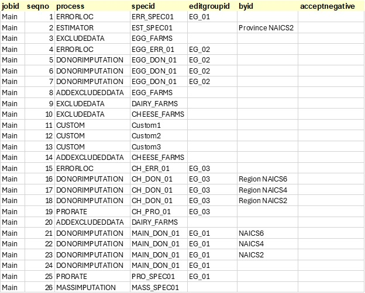

# An Introduction to Process Blocks and Process Controls

Process Controls and Process Blocks are new features introduced in the Python version of the Banff Processor. These new features were introduced to improve job organization and reduce the need for user defined processes that perform data management tasks.

See [Process Controls](./processor-user-guide.md#process-controls) and [Process Blocks](./processor-user-guide.md#process-blocks) in the general guide.

A process in a Banff Processor job typically has two primary inputs:
- InData (Imputed File): The primary target of the statistical data editing process, comprised of microdata with a unique record identifier (unit_id).
- InStatus (Status File): Status flags, identified by the record and field identifiers.

After a process is complete, there are typically two key outputs:
- OutData: A dataset containing imputed data. This is a subset of InData. For efficiency purposes, this dataset only needs the rows and columns that were changed on the process.  
- OutStatus: A dataset containing the field that had their status changed by the process. This only needs to include changes. 

Throughout the process, a three key datasets are constantly updated:
- Imputed File (InData) is initially a copy of the original micro data, but is updated with OutData after each process.
- Status File (InStatus) is initially a copy of the original dataset (if provided) but is updated with OutStatus after each process.
- Status Log is appended with OutStatus to provide a process log of track how a field's status changed throughout the entire process.

The follow diagram depicts the typical flow of data in and out of a process step that performs editing and imputation:

Note that InData and InStatus are the main input datasets, but other input datasets may exist and process controls can be applied to them. Likewise, process steps may output additional datasets.

## The Traditional Approach

For illustrative purposes, we consider the following Banff job, “Main”, with 26 process steps:

In the past, if a user wanted to run a block of steps on only a subset of data (which is a very common practice), they needed to run custom code to first exclude a portion of data, (removing it from the Imputed_File), save it somewhere else, and then add it back later, with another custom step:

If they want to apply a second filter within an existing filter, these must be nested:  

This approach comes with risks and drawbacks:
- Human error: A mistake with the custom programs, if not handled properly, will affect the data file for ALL remaining steps, not just the steps between the custom programs.
- Tracking: Users must manually track when a custom program starts and stops, to ensure data is added back at the right moment.
- Organization: When looking at an individual step, the filter is not obvious, without first scanning up or down within the process steps.

### Process Blocks

The Process Block feature is essentially the ability to call a job from within a job. This allows a Process Control to be efficiently be applied to multiple steps.

The example job “Main” appears as one linear job with 26 steps. However, the process flow contains many individual blocks that perform different data editing functions. This presents issues when:
- Different users need to work on different blocks separately, adding, removing, or re-ordering steps.
- Users may want to test blocks of steps separately from others.
- Users may wish to apply conditions, such as data exclusion, to a block of steps.

These types of activities are challenging with the current arrangement. For example, if a user wants to add a step somewhere in the middle of the process, they either need to change all subsequent sequence numbers, or give their new step a decimal sequence number representation. To “move” blocks around, all sequence numbers must change.

As another example, if a user wants to test only a portion of the code, they need to copy those steps, make changes, give the block a new Job name, run their tests, reintegrate those changes into the main job, and delete the other job.
 
Here is the same process flow using these new features:

  
In this case, the user has broken the same set of steps into five blocks:
- Main: The primary process, with high-level steps
- EGG_IMPUTATION: A sub-job focused on imputation of egg farms
- DAIRY_IMP: A sub-job focused on imputation of dairy farms
    - CHEESE: A sub-job focused on cheese farms
    - MAIN_DONOR: A sub-job imputing all remaining values

The “Main” job calls three blocks as sub-jobs: EGG_IMPUTATION, DAIRY_IMP and MAIN_DONOR. Note that DAIRY_IMP also calls a sub-job, CHEESE.

When a step Process = JOB, the SpecID should refer to another Job in the table:

 

The nested approach can be summarized in this chart below. Note that the process is still linear, but that jobs can be nested within other jobs.

## Process Controls

With Process Controls, instead of individual steps that exclude data and add them back alter, a new column (ControlID) allows users to specify individual process controls that are applied to specific steps, or blocks of steps:

 
Here we see that for Step 3, the “EGG_FARMS” process control is applied to the “EGG_IMPUTATION” job and the “DAIRY_FARMS” process control is applied to the “DAIRY_IMP” job. This approach addresses the issues brought up earlier regarding data filters.

At this point, the Processor should set up inputs to run just as it would for a process step:

- Inputs for the process block (“EGG_IMPUTATION”) are created:
    - InData is a copy of Imputed_File (code reference)
    - InStatus is a copy of Status_File (code reference)

Run the process block (i.e., sub-job “EGG_IMPUTATION”) which creates the following outputs:

1. Imputed_File is updated with OutData (code reference)
2. Status_File is updated with OutStatus (code reference)
3. Status_Log is appended with OutStatus
- Now update the files from the original job (“MAIN”):
1. Main.Imputed_File is updated with EGG_IMPUTATION.Imputed_File
2. Main.Status_File is updated with EGG_IMPUTATION.Status_File
3. Main.Status_Log is appended with EGG_IMPUTATION.Status_Log

# Conclusion

Overall process controls and process blocks can help create better designed imputation strategies in the Banff Processor making the job more maintainable, readable and efficient. Although, the traditional approach can still be used, we encourage the use of these new features. Using these new features may have even more benefits in the future such as parallel processing support and improved variance to due imputation results.