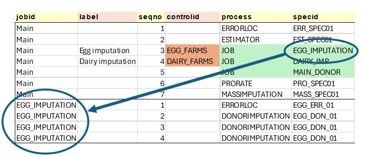
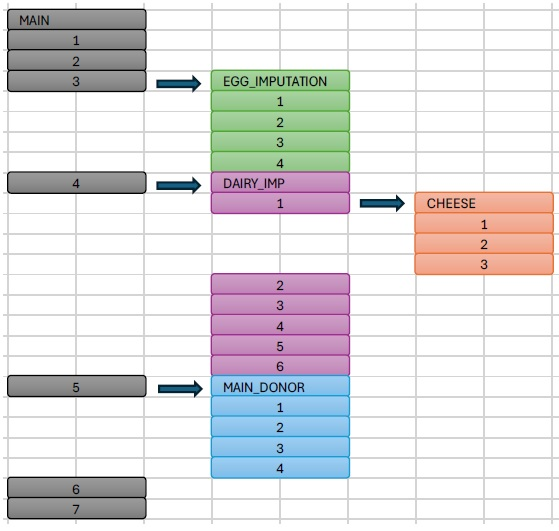

# Introduction aux blocs de processus et aux contrôles de processus

Les contrôles de processus et les blocs de processus sont de nouvelles fonctionnalités introduites dans la version Python du processeur Banff. Ces nouvelles fonctionnalités ont été introduites pour améliorer l'organisation des tâches et réduire le besoin de processus définis par l'utilisateur qui effectuent des tâches de gestion des données.

Voir [Contrôles de processus](./processor-user-guide.md#controles-de-processus) et [Blocs de processus](./processor-user-guide.md#blocs-de-processus) dans le guide général.

Un processus dans une tâche du processeur Banff a généralement deux entrées principales:

- InData (fichier imputé): la cible principale du processus d'édition de données statistiques, composée de microdonnées avec un identifiant d'enregistrement unique (unit_id).
- InStatus (fichier d'état): indicateurs d'état, identifiés par les identifiants d'enregistrement et de champ.

Une fois un processus terminé, il existe généralement deux sorties principales:

- OutData: un ensemble de données contenant des données imputées. Il s'agit d'un sous-ensemble d'InData. Pour des raisons d'efficacité, cet ensemble de données n'a besoin que des lignes et des colonnes qui ont été modifiées au cours du processus.
- OutStatus: un ensemble de données contenant le champ dont le statut a été modifié par le processus. Il ne doit inclure que les modifications.

Tout au long du processus, trois ensembles de données clés sont constamment mis à jour:

- Le fichier imputé (InData) est initialement une copie des microdonnées d'origine, mais est mis à jour avec OutData après chaque processus.
- Le fichier d'état (InStatus) est initialement une copie de l'ensemble de données d'origine (si fourni) mais est mis à jour avec OutStatus après chaque processus.
- Le journal d'état est ajouté à OutStatus pour fournir un journal de processus permettant de suivre l'évolution du statut d'un champ tout au long du processus.

Le diagramme suivant illustre le flux typique de données entrant et sortant d'une étape de processus qui effectue l'édition et l'imputation:

Notez que InData et InStatus sont les principaux ensembles de données d'entrée, mais d'autres ensembles de données d'entrée peuvent exister et des contrôles de processus peuvent leur être appliqués. De même, les étapes de processus peuvent générer des ensembles de données supplémentaires.

## L'approche traditionnelle

À des fins d’illustration, nous considérons le travail suivant de Banff, `Main`, avec 26 étapes de processus:

Par le passé, si un utilisateur souhaitait exécuter un bloc d'étapes sur un seul sous-ensemble de données (ce qui est une pratique très courante), il devait exécuter un code personnalisé pour d'abord exclure une partie des données (en la supprimant du fichier imputé), l'enregistrer ailleurs, puis l'ajouter plus tard, avec une autre étape personnalisée:

S'ils veulent appliquer un deuxième filtre au sein d'un filtre existant, ceux-ci doivent être imbriqués: 

Cette approche comporte des risques et des inconvénients:

- Erreur humaine: une erreur dans les programmes personnalisés, si elle n'est pas gérée correctement, affectera le fichier de données pour TOUTES les étapes restantes, et pas seulement les étapes entre les programmes personnalisés.
- Suivi: les utilisateurs doivent suivre manuellement le démarrage et l'arrêt d'un programme personnalisé, afin de garantir que les données sont rajoutées au bon moment.
- Organisation: lorsqu'on examine une étape individuelle, le filtre n'est pas évident, sans d'abord parcourir les étapes du processus de haut en bas.

### Blocs de processus

La fonctionnalité Bloc de processus est essentiellement la capacité d'appeler une tâche à partir d'une tâche. Cela permet d'appliquer efficacement un contrôle de processus à plusieurs étapes.

L'exemple de tâche `Principal` apparaît comme une tâche linéaire avec 26 étapes. Cependant, le flux de processus contient de nombreux blocs individuels qui exécutent différentes fonctions d'édition de données. Cela pose des problèmes lorsque:

- Différents utilisateurs doivent travailler sur différents blocs séparément, en ajoutant, en supprimant ou en réorganisant des étapes.

- Les utilisateurs peuvent vouloir tester des blocs d'étapes séparément des autres.

Les utilisateurs peuvent souhaiter appliquer des conditions, telles que l'exclusion de données, à un bloc d'étapes.

Ces types d'activités sont difficiles avec l'organisation actuelle. Par exemple, si un utilisateur souhaite ajouter une étape quelque part au milieu du processus, il doit soit modifier tous les numéros de séquence suivants, soit donner à sa nouvelle étape une représentation de numéro de séquence décimal. Pour `déplacer` des blocs, tous les numéros de séquence doivent changer.

À titre d’exemple, si un utilisateur souhaite tester uniquement une partie du code, il doit copier ces étapes, apporter des modifications, donner au bloc un nouveau nom de tâche, exécuter ses tests, réintégrer ces modifications dans la tâche principale et supprimer l’autre tâche.

Voici le même flux de processus utilisant ces nouvelles fonctionnalités:

  
Dans ce cas, l'utilisateur a divisé le même ensemble d'étapes en cinq blocs:

- Main: le processus principal, avec des étapes de haut niveau
- EGG_IMPUTATION: un sous-travail axé sur l'imputation des fermes d'œufs
- DAIRY_IMP: un sous-travail axé sur l'imputation des fermes laitières
- CHEESE: un sous-travail axé sur les fermes fromagères
- MAIN_DONOR: un sous-travail imputant toutes les valeurs restantes

Le travail `Main` appelle trois blocs comme sous-travail: EGG_IMPUTATION, DAIRY_IMP et MAIN_DONOR. Notez que DAIRY_IMP appelle également un sous-travail, CHEESE.

Lorsqu'une étape Process = JOB, le SpecID doit faire référence à un autre travail dans la table:

 

L'approche imbriquée peut être résumée dans le tableau ci-dessous. Notez que le processus est toujours linéaire, mais que les tâches peuvent être imbriquées dans d'autres tâches.

## Contrôles de processus

Avec les contrôles de processus, au lieu d'étapes individuelles qui excluent les données et les rajoutent ensuite, une nouvelle colonne (ControlID) permet aux utilisateurs de spécifier des contrôles de processus individuels qui sont appliqués à des étapes spécifiques ou à des blocs d'étapes:

 
Ici, nous voyons que pour l'étape 3, le contrôle de processus `EGG_FARMS` est appliqué à la tâche `EGG_IMPUTATION` et le contrôle de processus `DAIRY_FARMS` est appliqué à la tâche `DAIRY_IMP`. Cette approche répond aux problèmes évoqués précédemment concernant les filtres de données.

À ce stade, le processeur doit configurer les entrées pour qu'elles s'exécutent comme il le ferait pour une étape de processus:

- Les entrées du bloc de processus (`EGG_IMPUTATION`) sont créées:
- InData est une copie de Imputed_File (référence de code)
- InStatus est une copie de Status_File (référence de code)

Exécutez le bloc de processus (c'est-à-dire le sous-travail `EGG_IMPUTATION`) qui crée les sorties suivantes:

1. Imputed_File est mis à jour avec OutData (référence de code)
2. Status_File est mis à jour avec OutStatus (référence de code)
3. Status_Log est ajouté à OutStatus

Mettez maintenant à jour les fichiers du travail d'origine (`MAIN`):

1. Main.Imputed_File est mis à jour avec EGG_IMPUTATION.Imputed_File
2. Main.Status_File est mis à jour avec EGG_IMPUTATION.Status_File
3. Main.Status_Log est ajouté à EGG_IMPUTATION.Status_Log

## Conclusion

Les contrôles de processus globaux et les blocs de processus peuvent aider à créer des stratégies d'imputation mieux conçues dans le processeur Banff, ce qui rend le travail plus facile à gérer, plus lisible et plus efficace. Bien que l'approche traditionnelle puisse toujours être utilisée, nous encourageons l'utilisation de ces nouvelles fonctionnalités. L'utilisation de ces nouvelles fonctionnalités pourrait avoir encore plus d'avantages à l'avenir, comme la prise en charge du traitement parallèle et une meilleure variance des résultats d'imputation.